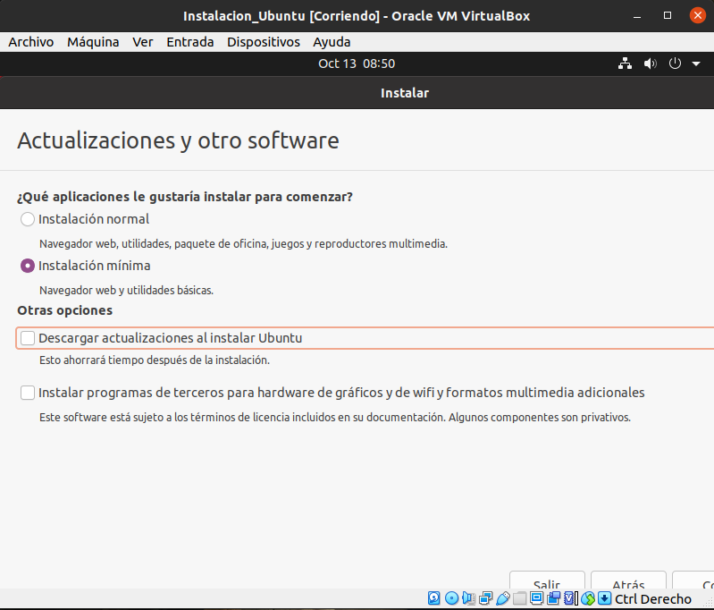

# Instalacion de Ubuntu

## 1 Creacion de la maquina en VirtualBox
> En esta practica nos centraremos en la instalacion desde cero de una máquina virtual Ubuntu, estará explicado paso a paso con las capturas respectivas en todos los apartados.

### 1.1 Creacion de una máquina virtual

Lo primero que haremos será crear la maquina virtual en la cuál luego instalaremos el sistema, para ello, tendremos que clickar en "Nuevo" y completar el "Nombre" y el tipo de Sistema que se quiere instalar.

### 1.2 Configuracion de la memoria

Una vez hecho el apartado anterior tendremos que seleccionar la cantidad de memoria RAM que querramos utilizar solamente para la máquina. En este caso hemos puesto una cantidad de 2048MB, que es lo equivalente a 2GB.

### 1.3 Seleccion del tipo de Disco
Lo siguiente que tendremos que hacer será seleccionar que tipo de Disco queremos crear, en nuestro caso usaremos "VDI".

Y lugo lo pondremos de manera dinámica para que el espacio se vaya usando según su uso

### 1.4 Creacion del Disco Duro Virtual

En este apartado tendremos que seleccionar el tamaño del disco que querramos usar para el sistema, en este caso pondremos solo 15GB.

### 1.5 Selección del Sistema para la máquina virtual
>Si hemos hecho todos los pasos anteriores, se cerrará la pestaña en la cual estabamos configurando la máquina virtual y veremos que se ha creado correctamente

Ahora tendremos que entrar a la configuración de la máquina que hemos creado e iremos al apartado de "Almacenamiento"

Cuando esteamos en ese apartado clickaremos en el disco y le daremos a  "Selecciona sistema de disco..." y seleccionaremos la ISO del sistema operativo que querramos utilizar.

> Una vez insertada la ISO, aceptaremos los cambios y ejecutaremos la máquina. 

## 2 Instalación del Sistema Operativo
El primer paso será seleccionar el idioma que querramos realizar la instalación (En este caso será el Español) y le daremos a "Instalar Ubuntu".

### 2.1 Selección de Idioma
>Nos aparecerá una lista de paises, esto aparece para la selección de el idioma del teclado según el pais, en nuestro caso tambien le daremos a "España" y le daremos a "Continuar".

### 2.2 Tipo de Instalación 
En esta pestaña tendremos que seleccionar el tipo de instalación que preferimos en nuestro sistema, en este caso haremos una Instalación Mínima y le daremos a actualizar.

### 2.3 Elección de  disco duro
El último paso para instalar el Sistema Operativo será borrar y eliminar las particiones del disco duro, en este caso seleccionamos la opción de "Borrar disco e instalar Ubuntu" y le damos a Instalar.

### 2.4 Eleccion de ubicación
> En este apartado solo tendremos que indicar la uubicación desde la cual instalamos el sistema.

### 2.5 Indicación de datos del equipo de inicio de sesión y de seguridad

En esta pestaña tendremos que añadir un nombre de usuario y una contraseña que nos servirá luego para iniciar sesión.

### 2.6 Instalacion
>Una vez hecho los pasos anteriores nos aparecerá la pestaña siguiente, lo que significará que ya se está instalando el Sistema Operativo.

### 2.7 Reinicio del Sistema
>Cuando haya acabado el proceso de instalacion nos aparecerá una pestaña que nos pedirá que reiniciamos el Sistema Operativo, le daremos a "Reiniciar Ahora" y cuando se haya reiniciado ya lo tendríamos completado.

Y ya tendremos instalado Ubuntu.

