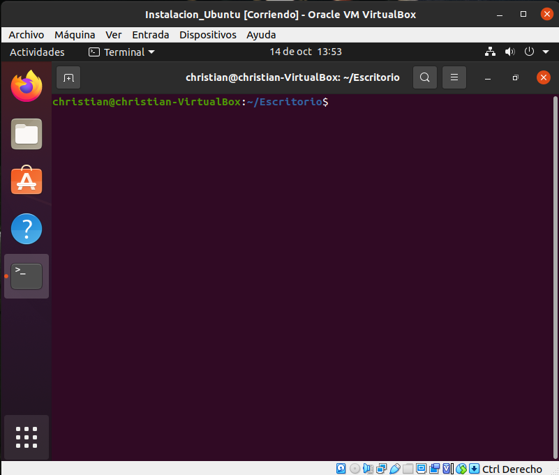
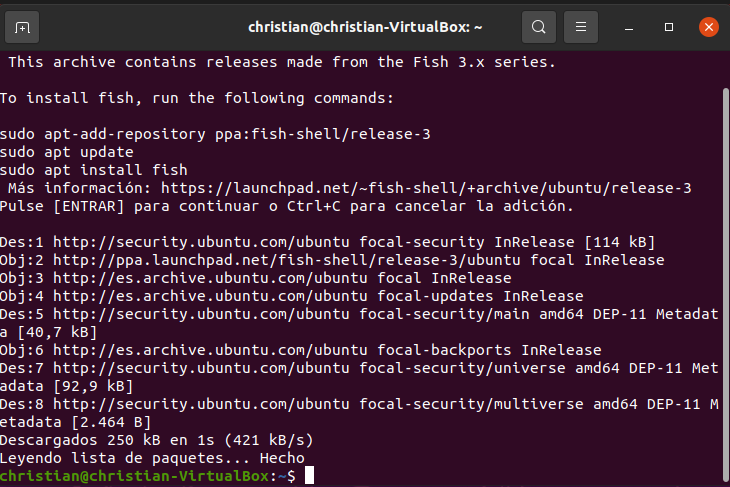
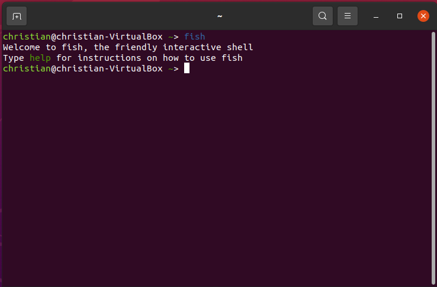
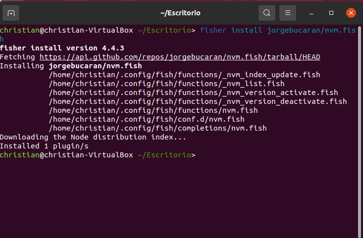
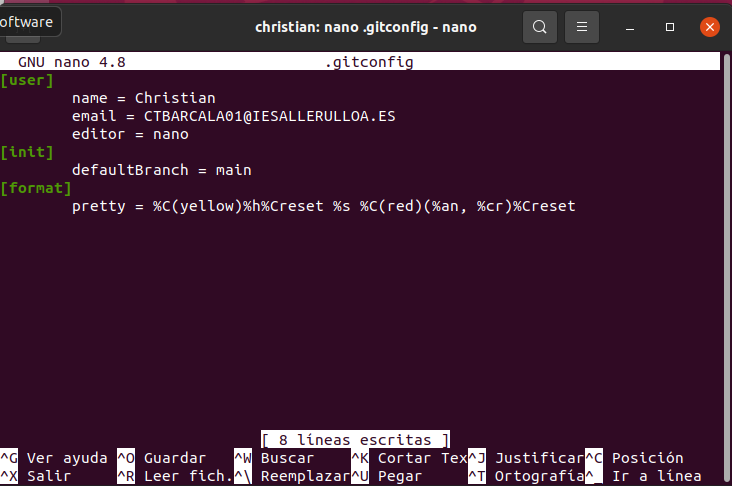

# Instalacion de Ubuntu

## 1 Creacion de la maquina en VirtualBox
> En esta practica nos centraremos en la instalacion desde cero de una máquina virtual Ubuntu, estará explicado paso a paso con las capturas respectivas en todos los apartados.

### 1.1 Creacion de una máquina virtual

Lo primero que haremos será crear la maquina virtual en la cuál luego instalaremos el sistema, para ello, tendremos que clickar en "Nuevo" y completar el "Nombre" y el tipo de Sistema que se quiere instalar.

### 1.2 Configuracion de la memoria

Una vez hecho el apartado anterior tendremos que seleccionar la cantidad de memoria RAM que querramos utilizar solamente para la máquina. En este caso hemos puesto una cantidad de 2048MB, que es lo equivalente a 2GB.

### 1.3 Seleccion del tipo de Disco
Lo siguiente que tendremos que hacer será seleccionar que tipo de Disco queremos crear, en nuestro caso usaremos "VDI".

Y lugo lo pondremos de manera dinámica para que el espacio se vaya usando según su uso

### 1.4 Creacion del Disco Duro Virtual

En este apartado tendremos que seleccionar el tamaño del disco que querramos usar para el sistema, en este caso pondremos solo 15GB.

### 1.5 Selección del Sistema para la máquina virtual
>Si hemos hecho todos los pasos anteriores, se cerrará la pestaña en la cual estabamos configurando la máquina virtual y veremos que se ha creado correctamente

Ahora tendremos que entrar a la configuración de la máquina que hemos creado e iremos al apartado de "Almacenamiento"

Cuando esteamos en ese apartado clickaremos en el disco y le daremos a  "Selecciona sistema de disco..." y seleccionaremos la ISO del sistema operativo que querramos utilizar.

> Una vez insertada la ISO, aceptaremos los cambios y ejecutaremos la máquina. 

## 2 Instalación del Sistema Operativo
El primer paso será seleccionar el idioma que querramos realizar la instalación (En este caso será el Español) y le daremos a "Instalar Ubuntu".

### 2.1 Selección de Idioma
>Nos aparecerá una lista de paises, esto aparece para la selección de el idioma del teclado según el pais, en nuestro caso tambien le daremos a "España" y le daremos a "Continuar".

### 2.2 Tipo de Instalación 
En esta pestaña tendremos que seleccionar el tipo de instalación que preferimos en nuestro sistema, en este caso haremos una Instalación Mínima y le daremos a actualizar.

### 2.3 Elección de  disco duro
El último paso para instalar el Sistema Operativo será borrar y eliminar las particiones del disco duro, en este caso seleccionamos la opción de "Borrar disco e instalar Ubuntu" y le damos a Instalar.

### 2.4 Eleccion de ubicación
> En este apartado solo tendremos que indicar la uubicación desde la cual instalamos el sistema.

### 2.5 Indicación de datos del equipo de inicio de sesión y de seguridad

En esta pestaña tendremos que añadir un nombre de usuario y una contraseña que nos servirá luego para iniciar sesión.

### 2.6 Instalacion
>Una vez hecho los pasos anteriores nos aparecerá la pestaña siguiente, lo que significará que ya se está instalando el Sistema Operativo.

### 2.7 Reinicio del Sistema
>Cuando haya acabado el proceso de instalacion nos aparecerá una pestaña que nos pedirá que reiniciamos el Sistema Operativo, le daremos a "Reiniciar Ahora" y cuando se haya reiniciado ya lo tendríamos completado.

### Instalacion de las Guesst Additions
Ahora instalaremos las Guesst Additions, para ello tendremos que dirigirnos a dispositivos y le daremos a "Insertar imagen CD de las Guesst Additions"

Una vez hayamos clickado nos aparecera si lo querremos ejecutar, le daremos a "Aceptar" y nos aparecerá lo siguiente:

Y ya tendremos instalado Ubuntu.

## 3 Actualización del Sistema
> En este apartado nos dedicaremos a actualizar e instalar paquetes de ubuntu, los cuales no tenemos descargados por haber realizado una instalación básica.

### 3.1 Terminal
El primer paso para la instalacion de paquetes, será abrir un terminar, para ello haremos click derecho en el escritorio y luego le daremos a "Abrir en una terminal"

### 3.1 Instalación por comandos
Una vez que hayamos abierto el terminal, tendremos que instalar con paquetes a través de comando, los comando serán los siguientes.

>Nota: Después de ejecutar cada comando con *sudo*  nos pedirá nuestra contraseña.
~~~
> sudo apt update
~~~

~~~
> sudo apt upgrade
~~~

Nos preguntará si queremos continuar, le indicaremos que si, para ello escribiremos "y" y le daremos a enter.

Una vez hayamos hecho esto tendremos el Sistema con los paquetes actualizados.

### Instalación de Fish 
Ahora Instalaremos el paquete "Fish", para ello ejecutaremos los siguientes comandos:
~~~
> sudo apt-add-repository ppa:fish-shell/release-3
~~~

~~~
> sudo apt update
~~~

~~~
> sudo apt install fish
~~~

Ahora entraremos en el shell de fish, para ello el comando sera:

~~~
Fish
~~~

Antes de nada instalaremos Curl, el cuál mecesitaremos para instalar Fish.

~~~
sudo apt install curl
~~~

### Instalación de Pure

Ahora intalaremos el Pure, para eso usaremos el siguiente comando:

~~~
fisher install pure-fish/pure
~~~

### Instalación de pluggins de fish.

## Instalación de plugging Jorgebucaran

Una vez hecho esto volveremos a la instalación de  de pluggins de Fish, para ello usaremos el siguiente comando.

~~~
curl -sL https://git.io/fisher | source && fisher install jorgebucaran/fisher
~~~

~~~
fisher install jorgebucaran/nvm.fish
~~~

~~~
fisher install IlanCosman/tide@v5
~~~
Nos aparecerá lo siguiente:

Aqui tendremos que seleccionar el estilo que querramos usar, en mi caso es el siguiente.

 
## 2.0 Instalación de PatrickF1.

Ahora instalaremos el segundo plugging, para ello usaremos el siguiente comando.

~~~
fisher install patrickf1/colored_man_pages.fish
~~~

Ahora mostraremos los comandos para su uso.

~~~
man less
~~~

~~~
command man less
~~~

~~~
cless git help merge
~~~

~~~
cless git help log
~~~

### 3.2 Instalación de Git

>Ahora instalaremos Git en nuestra máquina virtual, para ello usaremos los siguientes comandos

~~~
sudo add-apt-repository ppa:git-core/ppa
~~~

~~~
sudo apt update
~~~

~~~
sudo apt install git
~~~

>Ahora comprobaremos la version de Git.

~~~
git version
~~~

## 3.3 Configuración de fish como Shell por defecto

~~~
which fish
~~~

~~~
chsh -s /usr/bin/fish
~~~

### 3.4 Configuración de Git
>Una vez hechos instalado Git tendremos que configurarlo

~~~
cd ~
git config --global user.name "AQUI VA TU NOMBRE"
git config --global user.email AQUI_VA_TU_EMAIL@WHATEVER.COM
git config --global core.editor AQUI_VA_TU_EDITOR
git config --global init.defaultBranch main
~~~

~~~
git config --list --show-origin
~~~

Y ahora editaremos con "nano" y añadiremos lo siguiente
~~~
[format]
	pretty = %C(yellow)%h%Creset %s %C(red)(%an, %cr)%Creset
~~~

## 4 Clonación repositorio git en otra máquina
>En este apartado clonaremos nuestro repositorio Git en el sistema que hemos creado en esta práctica.

### 4.1 Instalación de SSH

~~~
sudo apt-get install openssh-client
~~~

### 4.2 Generación de claves SSH 
~~~
cd ~
ssh-keygen -t ed25519 -C "christiantabada15@gmail.com"
~~~

~~~
bash
eval "$(ssh-agent -s)"
fish
~~~

#### Clave Privada del SSh
~~~
ssh-add ~/.ssh/id_ed25519
~~~

~~~
sudo apt install xclip
xclip -sel clip < ~/.ssh/id_ed25519.pub
~~~

## 5 Agregar clave ssh a Github
Este paso lo tendremos que hacer en Git hub, para ello entraremos a nuestro perfil y luego iremos a "Configuración" y luego a "SSH and GPG keys" y le daremos a "New SSH Key" y completaremos conel nombre de la LLave Ssh y completar con nuestra llave.

### Clonación
Lo siguiente que tendremos que hacer será ir al repositorio que vamos a clonar, y añadiremos la clave SSH.

Ahora nos dirigiremos de nuevo al terminal de nuestra máquina y pondremos el siguiente comando con la key del SSH.

~~~
git  clone [enlace del repositorio copiado]
~~~

